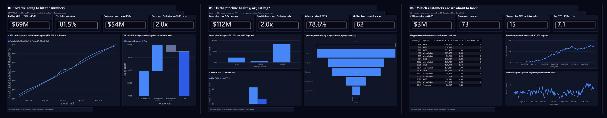

# FlowTrack RevOps Analytics MVP

*A two‑day, end‑to‑end data pipeline and executive reporting package for a synthetic \$15 M‑ARR B2B SaaS company covering FY‑2023 & FY‑2024.*

---

## 📌 Overview

FlowTrack simulates the **Marketing → Sales → Customer‑Success** funnel of a SaaS firm for demonstration and interview purposes.  Starting from 14 raw CSVs, the project spins up a PostgreSQL database, automated data‑quality tests, fiscal‑year KPI extracts, and two presentation artifacts:

1. **Revenue Operations instrument** – a 5‑page, decision‑first Power BI report built as a text‑based .pbip project (TMDL semantic model + PBIR pages), with a hidden validation page that ties every measure to independently verified figures.
2. **South‑Region Churn Deep‑Dive** – a single‑page PDF analysing Q3‑2024 churn drivers.

Everything is reproducible via the bash & Python commands in this repo; no manual number‑entry.

---

## 🎯 Key Deliverables

| Asset                             | Path                                           |
| --------------------------------- | ---------------------------------------------- |
| Automated QA HTML report          | `docs/reports/lite_QA_Q1-24.html`              |
| KPI CSV extracts (FY 23/24)       | `data/processed/`                              |
| RevOps instrument (Power BI project) | `dashboards/FlowTrackRevOps.pbip` + source dirs |
| Instrument page captures | `docs/assets/instrument-0*.png` |
| South‑churn deep‑dive slide       | `docs/reports/churn_deep_dive_Q3-24.pdf`       |

*(The Revenue Operations instrument — exec, pipeline, and renewal pages)*

<p align="center"></p>

---

## Folder Structure

```text
flowtrack-revops-mvp/
├─ raw_csv/                # original 14 CSVs
├─ sql/                    # DDL & analytic views
│   ├─ ddl_constraints.sql
│   └─ views/
├─ scripts/                # Python & shell automation
│   ├─ load_raw.py
│   ├─ get_fy_kpis.py
│   └─ churn_deep_dive_Q3-24.py
├─ tests/                  # PyTest + pytest-html suite
├─ data/processed/         # Generated KPI CSVs
├─ dashboards/             # Power BI project (FlowTrackRevOps.pbip — TMDL + PBIR source)
├─ docs/
│   ├─ reports/            # HTML + PDF outputs
│   └─ assets/             # Screenshots / logos
├─ helpers/                # Shared Python utils
│   └─ db.py
├─ requirements.txt        # Python deps (lock-file)
```

---

## ⚡ Quick Start

```bash
# 1 - clone & prepare env
git clone https://github.com/thebryce15/flowtrack-revops-mvp.git
cd flowtrack-revops-mvp
python -m venv .venv && source .venv/bin/activate   # Windows: .venv\Scripts\Activate.ps1
pip install -r requirements.txt

# 2 - configure DB creds
cp .env.example .env   # edit values for your local Postgres
createdb flowtrack_data     # or point to an existing db

# 3 - load raw data
python scripts/load_raw.py   # creates schemas, loads the 14 raw CSVs, builds constraints

# 4 - build the analytic views
bash scripts/create_views.sh

# 5 - run automated QA (5 sec)
pytest --html=docs/reports/lite_QA_Q1-24.html --self-contained-html

# 6 - generate KPIs
python scripts/get_fy_kpis.py   # writes the FY23/FY24/combined CSVs into data/processed/
```

*You should now be able to open `dashboards/FlowTrackRevOps.pbip` in Power BI Desktop and refresh against your local data.*

---

## 🗃 Data provenance

The 14 raw CSVs were produced by one‑off Faker‑based generator scripts that were
not preserved; the committed files in `raw_csv/` are the canonical dataset, and
`raw_csv/data_quality_report.txt` is the generation‑time QA log. The activity log
was deduplicated after generation (13,238 exact double‑emitted rows removed);
`scripts/check_raw_integrity.py` encodes the expected volumes.

---

## 🧪 Tests

* **Row‑count bands** ensure synthetic data volumes stay realistic.
* **Foreign‑key integrity** guarantees joins across Marketing, Sales, and CS remain reliable.
* All tests executed via **PyTest** and rendered to a self‑contained HTML report—ideal for CI pipelines or pull‑request gates.
* A stricter CLI check (`scripts/check_raw_integrity.py`) validates realistic row-count bands and FK orphans across all 14 raw tables.

---

## 🗄 Tech Stack

| Layer                    | Tooling                                                         |
| ------------------------ | --------------------------------------------------------------- |
| Data storage             | PostgreSQL (schemas: `flowtrack_raw`, `flowtrack_analytics`)    |
| Data loading & transform | Python 3.13 · pandas · SQLAlchemy                               |
| Quality assurance        | PyTest · pytest‑html                                            |
| Visualisation            | **Power BI** (desktop)                                          |
| Reporting output         | Power BI project (.pbip) + PNG page captures                    |

---

## 🛣 Road‑Map

* CI workflow to spin up Postgres in GitHub Actions and run QA on every push.
* dbt refactor of analytic views.
* Incremental data‑refresh pipeline using Airflow or Prefect.

---

## 📜 License

Released under the MIT License – see `LICENSE` for details.

---

## 👋 Author

**Bryce Smith**
Revenue/Business Operations Analyst
[LinkedIn](https://www.linkedin.com/in/brycesmith-ops/) • [GitHub](https://github.com/thebryce15)
